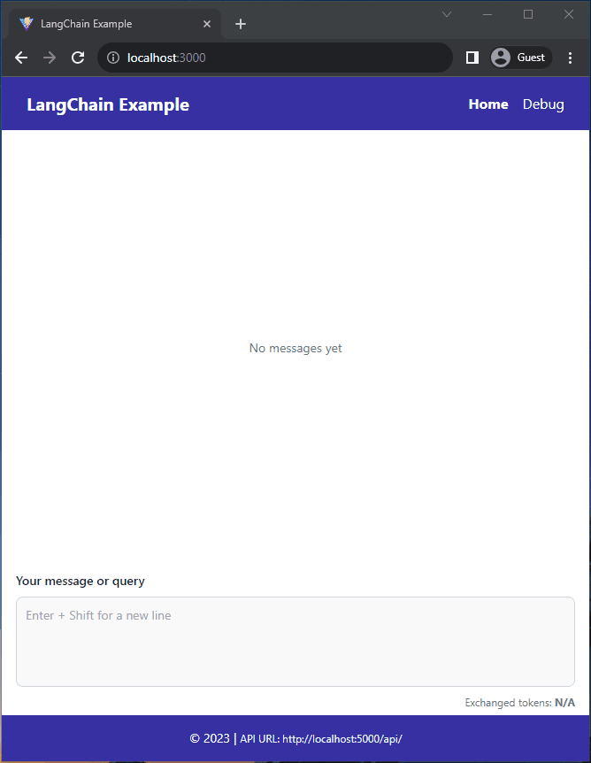

# LangChain Example

A full end to end example that demonstrates how to create LLM enabled web application using the LangChain library.



## Software components

- A [backend app](./backend/README.md) using [Quart](https://github.com/pallets/quart)
- A [react frontend](./frontend/README.md) with [Vite](https://vitejs.dev/)

## Features

- A ChatGPT like interface, directly connecting to a LangChain API
- Ability to process SQL database using the SQL Agent
- Response streaming capabilities using [react-async-typewriter](https://github.com/usersina/react-async-typewriter)

## Getting Started

### 1. Backend

See the [directory's documentation](./backend/README.md) for locally running the backend

### 2. Frontend

```bash
(cd frontend && yarn install && yarn dev)
```
